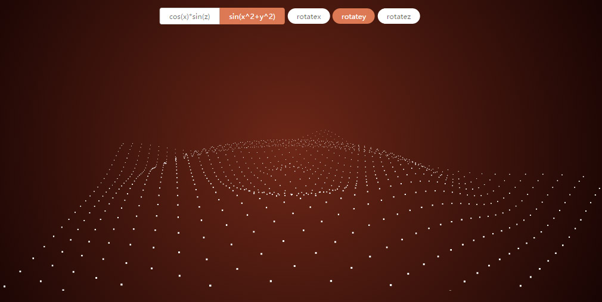

# F3.js

Fake 3D，实现在 canvas(Context2d) 上绘制 3D 场景。

用三维坐标定义物体位置，在绘制的时候转换成对应的屏幕坐标实现简单的三维效果。

思路文章：[http://gnauhca.com/blog/2017/03/13/canvas/canvas-getcontext(3d)/](http://gnauhca.com/blog/2017/03/13/canvas/canvas-getcontext(3d)/)


## 用法：

* F3.Camera // 相机
* F3.Scene // 场景，添加物体
* F3.Obj // 物体
* F3.Renderer // 渲染器
* F3.TIME // 全局时间
* F3.Time // 时间
* F3.Vector3 // 三维向量，直接参考 three.js Vector3
* F3.Euler // 欧拉角，描述旋转，直接参考 three.js Euler


## 向量 F3.Vector3
二维向量都可以用三维向量替代(z=0)，api 参考 [https://threejs.org/docs/index.html?q=Vector3#Reference/Math/Vector3](https://threejs.org/docs/index.html?q=Vector3#Reference/Math/Vector3)

## 旋转 F3.Euler
描述旋转，api 参考 [https://threejs.org/docs/index.html?q=Euler#Reference/Math/Euler](https://threejs.org/docs/index.html?q=Euler#Reference/Math/Euler)

一个简单的应用，一个向量沿着 x 轴旋转 a，
```javascript
let e = new F3.Euler(a, 0, 0);
let v = new F3.Vector(1, 1, 1);
v.applyEuler(e); // 向量 v 应用该旋转
// 得到旋转之后新的向量值
```

## 相机 F3.Camera

```javascript
let camera = new Camera(1200, new F3.Vector3(cvs.width/2, cvs.height/2, 0));
```
#### 构造函数
>Camera(perspective, originVec);
##### perspective
{init} 相机到屏幕的距离 
##### originVec 
{Vector3} 相机正视屏幕的点-(z=0)

#### 方法：
##### getScaleByZ(z) 
根据 z 轴的值求出对应缩放值，返回缩放值 scale
##### get2DCrood(vec3) 
三维坐标转换成对应到屏幕的二维坐标(z=0)

## 物体 Obj
```javascript
let o = new F3.Obj;
o.position = new F3.Vector3(...);
o.render = function() {... use this.croods2D to draw something } // 自定义 render 方法
```
#### 属性：
##### position 
{Vector3} 物体坐标，如果有父母节点，就是相对父母节点的坐标，否则相对坐标原点(0,0,0)
##### scale 
{Vector3} 缩放向量默认 (1,1,1)
##### rotation 
{Euler} 物体的旋转值
##### vertices 
{Array} 向量数组，如果在 render 方法需要需要使用多个点时定义，这些点是相对物体位置定义的
##### croods2D 
{Object} 二维平面需要使用的属性，可在 render 方法里使用，在 render 方法被调用之前由 F3.js 自动计算出来
* croods2D.scale 使用相机 getScaleByZ 计算出来的缩放值，一般可用于在 render 方法里设置所画物件的大小，例如：画圆的时候，可以使用这个值动态设置半径
* position 物体 position 对应二维平面的坐标(z=0)
* vertices 向量数组对应二维平面的坐标(z=0) render 方法需要使用多个点时使用


#### 方法:

##### render(ctx, cvs) 
render方法，物体具体的绘画函数，需要用户重写，参数是 Renderer 里的 ctx 和 cvs，
##### add(Obj)
添加一个子物体，子物体的位置相对与当前物体定义
##### remove(Obj)
移除子物体


## 场景 Scene

用于添加物体

```javascript
let o = new F3.Obj;
let scene = new F3.Scene;
scene.add(o);
```

#### 属性
##### objs
{Array} 物体数组
#### 方法
##### add(Obj)
添加一个物体
##### remove(Obj)
移除子物体

## Renderer
渲染器

```javascript
let camera = new F3.Camera(...)
let scene = new F3.Scene
// create some  obj & scene add some objs...
let cvs = document.querySelector('canvas');
let ctx = cvs.getContext('2d');
let renderer = new F3.Renderer(ctx, cvs);
renderer.render(scene, camera);
```

#### 构造函数
>Renderer(ctx, cvs)
##### ctx
canvas 上下文对象，亦是属性
##### cvs 
canvas 对象，亦是属性

#### 方法
##### render(scene, camera)
将 camera 看到 scene 的内容渲染到 canvas 上
##### beforeRender
钩子，每次渲染之前需要做的事情，默认是清除画布，可重写
##### afterRender
钩子，每次渲染之后需要做的事情，可重写

## 时间 TIME 
全局时间

```javascript
F3.TIME.start();
```
#### 方法
##### start
开始全局时间
##### stop
暂停全局时间

## 时间对象 Time
```javascript
let time = new F3.Time;
F3.TIME.start();
```
由全局时间管理，全局时间 start 之后才工作
#### 方法
##### start
开始当前时间对象时间
##### stop
暂停当前时间对象时间
##### addTick(fn)
添加帧任务，每一帧都会被调用，返回值是帧任务对象，fn 是回调函数，参数是帧时间间隔 delta
##### removeTick(task)
移除帧任务,参数是需要移除的帧任务对象
##### addTween(tween)
添加 tween ，参考 [https://github.com/tweenjs/tween.js](https://github.com/tweenjs/tween.js)
##### removeTween(tween)
移除 tween

正在完善... 请参考 demo 文件夹
或直接在我的 [codepen](http://codepen.io/gnauhca/pen/PpNVwM) 查看 

